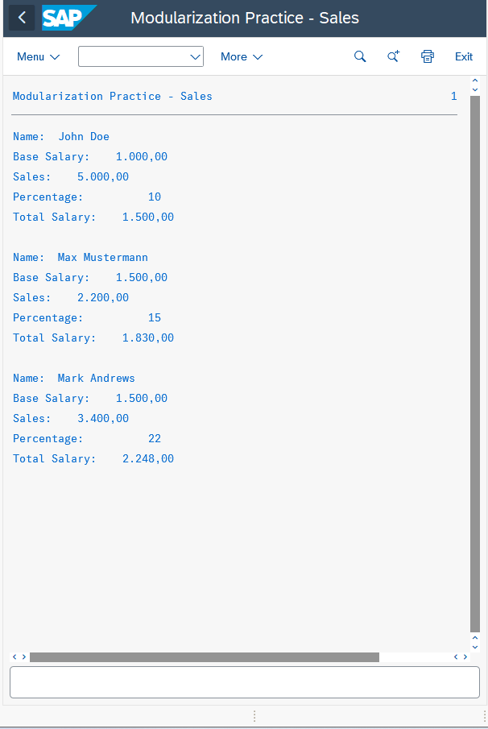

# ABAP Sales Employee Program

This ABAP program demonstrates the practical application of structures, internal tables, and modularization techniques. It allows creating sales employee records, calculating their total salary (base salary plus percentage of sales), and displaying the data in a structured format using a form subroutine.

This exercise was completed as part of the ABAP course covering ABAP concepts, ABAP SQL, and Core Data Services – Fundamentals.

---

## Objectives

- Define a structure type (`ty_employee`) with multiple components:
  - `name` (type `string`)
  - `base_salary` (type `P`, length 5, 2 decimal places)
  - `sales` (type `P`, length 5, 2 decimal places)
  - `percentage` (type `I`)
- Create a variable `my_employee` of type `ty_employee`.
- Assign sample values to all components.
- Define a standard internal table `it_employee` of type `ty_employee`.
- Insert multiple employees into the internal table using `APPEND` and the `VALUE` constructor.
- Use a `LOOP` to iterate over the internal table and call a subroutine for each employee.
- Define a form subroutine (`output`) with a `USING` parameter of type `ty_employee`.
- Calculate the total salary in the subroutine as:  

- Output each employee’s details on separate lines with labels (`Name`, `Base Salary`, `Sales`, `Percentage`, `Total Salary`).
- Include a blank line between employees for readability.

---

## Program Steps / Implementation

1. **Structure Definition:**  
 Created `ty_employee` with all required fields.

2. **Variable Creation:**  
 Defined `my_employee` of type `ty_employee`.

3. **Assign Sample Values:**  
 Populated `my_employee` with sample data (e.g., John Doe, Max Mustermann, Mark Andrews).

4. **Internal Table Creation:**  
 Defined `it_employee` as a standard table of `ty_employee`.

5. **Insert Employees:**  
 - First employee inserted using `APPEND`.  
 - Additional employees inserted using the `VALUE` constructor.

6. **Loop and Subroutine Call:**  
 Iterated over `it_employee` using `LOOP AT it_employee INTO my_employee` and called the `output` subroutine.

7. **Subroutine Implementation:**  
 - Defined `total_salary` as type `P LENGTH 5 DECIMALS 2`.  
 - Calculated total salary as:  
   ```
   total_salary = u_employee-base_salary + (u_employee-sales * u_employee-percentage / 100)
   ```
 - Displayed employee information on separate lines with labels.  
 - Added an empty line between employees for readability.

8. **Output Verification:**  
 Confirmed that three different employees are displayed with correct total salary calculations.

---

## Sample Output

