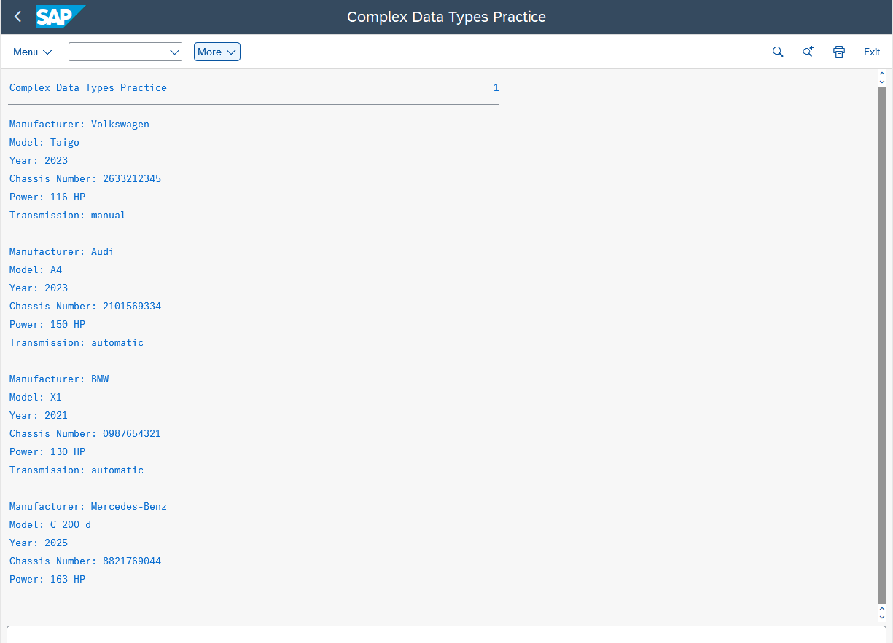

# ZZ_CLIENT_CARS

## Description
This ABAP program demonstrates the practical application of **structures** and **internal tables** in ABAP. It allows creating vehicle records, storing them in a standard internal table, and iterating through the table to display all vehicle data.  

This exercise was completed as part of the ABAP course covering **ABAP concepts, ABAP SQL, and Core Data Services – Fundamentals**.

---

## Objectives
- Define a **structure type** (`ty_car`) with multiple components including:
  - `manufacturer` (type C, length 20)  
  - `model` (type C, length 20)  
  - `year` (type N, length 4)  
  - `chassisnumber` (type N, length 10)  
  - Two additional fields to describe further characteristics of a vehicle (here: `power`, `transmission`)  
- Create a variable `mycar` of type `ty_car`.
- Assign sample values to all components.
- Output each component of the structure with proper labels.
- Define a **standard internal table** `itab` of type `ty_car` using `chassisnumber` as key.
- Insert multiple vehicles into the internal table using both `INSERT` statements and the `VALUE` constructor.
- Use a **LOOP** to iterate over the internal table and display all vehicle records.

---

## Program Steps / Implementation

1. **Structure Definition**: Created `ty_car` with all required fields.  
2. **Variable Creation**: Defined `mycar` typed with `ty_car`.  
3. **Assign Sample Values**: Populated `mycar` with sample vehicle data (e.g., Volkswagen Taigo, Audi A4, BMW X1, Mercedes C 200 d).  
4. **Output Structure**: Used `WRITE` statements to display each component on a separate line.  
5. **Internal Table Creation**: Defined `itab` as a standard table of `ty_car` with `chassisnumber` as key.  
6. **Insert Vehicles**:  
   - First two vehicles inserted using `INSERT`.  
   - Next two vehicles inserted using the `VALUE` constructor.  
7. **Loop and Display**: Iterated over `itab` using a `LOOP AT itab INTO mycar` statement and outputted each vehicle with a blank line in between.  

---

## Sample Output

